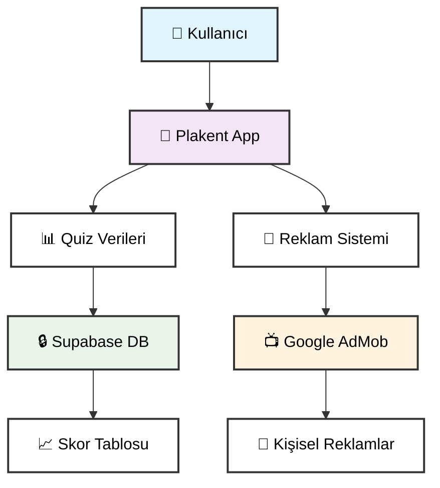

# 🛡️ Plakent - Gizlilik Politikası

<div align="center">


**🎯 Modern, Güvenli ve Kullanıcı Dostu Gizlilik Politikası**

[📖 Canlı Görüntüle](https://muharremosmantopakkaya.github.io/PlakentPrivacy/policy.html) • [📧 İletişim](mailto:plakentapp@gmail.com) 

</div>

---

## 🌟 Öne Çıkan Özellikler

<table>
<tr>
<td align="center">

<br/>
<strong>TLS Şifreleme</strong>
<br/>
<small>End-to-end güvenlik</small>
</td>
<td align="center">

<br/>
<strong>GDPR Uyumlu</strong>
<br/>
<small>Tam kullanıcı kontrolü</small>
</td>
<td align="center">

<br/>
<strong>Minimal Veri</strong>
<br/>
<small>Sadece gerekli veriler</small>
</td>
<td align="center">

<br/>
<strong>Veri Satışı Yok</strong>
<br/>
<small>%100 güvenilir</small>
</td>
</tr>
</table>

---

## 📊 Veri İşleme Haritası



---

## 🎯 Gizlilik İlkelerimiz

<div align="center">

| 🔍 **Şeffaflık** | 📊 **Minimal Veri** | 🔒 **Güvenlik** | 👑 **Kontrol** |
|:---:|:---:|:---:|:---:|
| Hangi verileri topladığımızı açık şekilde belirtiyoruz | Sadece gerekli verileri topluyoruz | Verilerinizi en üst düzeyde koruyoruz | Verileriniz üzerinde tam kontrole sahipsiniz |

</div>

---

## 📋 Veri Toplama Detayları

<details>
<summary><strong>🔽 Toplanan Veri Türleri (Tıklayın)</strong></summary>

### 📊 Veri Kategorileri

| Veri Türü | Açıklama | Zorunluluk | Saklama Süresi |
|-----------|----------|------------|----------------|
| **👤 Kullanıcı Adı** | Skor tablosu için |  | Kullanıcı isteğine kadar |
| **🎯 Quiz Verileri** | Doğru/yanlış cevaplar, skorlar |  | Aktif kullanım süresince |
| **📈 İlerleme** | Başarı oranları ve seviye bilgileri |  | Aktif kullanım süresince |
| **📺 Reklam Verileri** | AdMob reklam kimliği, etkileşimler |  | Google AdMob politikası |
| **📱 Cihaz Verileri** | Reklam kişiselleştirmesi için |  | Google AdMob politikası |

</details>

---

## 🛡️ Güvenlik Altyapısı

<div align="center">

```
┌─────────────────────────────────────────────────────────┐
│                   🔒 Güvenlik Katmanları                │
├─────────────────────────────────────────────────────────┤
│  🌐 TLS/SSL Şifreleme     │  📊 Supabase Altyapısı     │
│  🔐 Erişim Kontrolleri    │  🛡️ GDPR Uyumluluğu       │
│  🔄 Düzenli Güncellemeler │  📋 Veri Minimizasyonu     │
└─────────────────────────────────────────────────────────┘
```

</div>

---

## 👤 Kullanıcı Hakları (GDPR)

<div align="center">

### 🎯 Sahip Olduğunuz Haklar

</div>

| Hak | Açıklama | Süre | Nasıl Başvuru |
|-----|----------|------|---------------|
| **👁️ Erişim** | Verilerinizi görme | ⚡ Anında | 📧 Email |
| **✏️ Düzeltme** | Hatalı verileri düzeltme | 📅 7 gün | 📧 Email |
| **🗑️ Silme** | "Unutulma Hakkı" | 📅 30 gün | 📧 Email |
| **📦 Taşıma** | Verileri başka servise aktarma | 📅 15 gün | 📧 Email |
| **🚫 İtiraz** | Veri işlemeye itiraz | ⚡ Anında | 📧 Email |
| **📺 Reklam** | Kişiselleştirmeyi kapatma | ⚡ Anında | Cihaz Ayarları |

---

## 📺 Reklam Sistemi

<details>
<summary><strong>🔽 AdMob Entegrasyonu Detayları</strong></summary>

### 🎪 Reklam Türleri

<div align="center">

| Reklam Türü | Gösterim Zamanı | Kişiselleştirme | Kontrol |
|:---:|:---:|:---:|:---:|
| **🎬 Geçiş Reklamları** | Quiz bitişlerinde | ✅ Var | 🎛️ Ayarlardan |
| **💖 Can Kazanma** | Kullanıcı isteğiyle | ✅ Var | 🎛️ Ayarlardan |
| **🎯 Banner Reklamlar** | Oyun içi | ✅ Var | 🎛️ Ayarlardan |

</div>

### 🔧 Reklam Kontrolü

```bash
📱 Cihaz Ayarları > Gizlilik > Reklamlar > Kişiselleştirilmiş Reklamları Devre Dışı Bırak
```

</details>

---

## 👶 Çocuk Güvenliği

<div align="center">


**Özel Koruma Önlemleri**

| Kontrol | Açıklama |
|:---:|:---|
| 🛡️ **Yaş Kontrolü** | Reklam gösterimi için yaş uygunluğu |
| 👨‍👩‍👧‍👦 **Ebeveyn Onayı** | 13 yaş altı için gerekli |
| 🚫 **Pazarlama Yok** | Çocuklara özel pazarlama yapmayız |

</div>

---

## 🔄 Versiyon Geçmişi

<div align="center">

| Versiyon | Tarih | Değişiklikler | Durum |
|:---:|:---:|:---|:---:|
| **v1.2** | 21 Eylül 2025 | 📺 AdMob reklam sistemi entegrasyonu |  |
| **v1.1** | 12 Eylül 2025 | 🇪🇺 GDPR uyumluluk güncellemeleri |  |
| **v1.0** | Eylül 2025 | 🚀 İlk yayın |  |

</div>

---

## 📞 İletişim & Destek

<div align="center">

### 🎯 Bizimle İletişime Geçin

<table>
<tr>
<td align="center">

<br/>
<a href="mailto:plakentapp@gmail.com"><strong>plakentapp@gmail.com</strong></a>
<br/>
<small>Gizlilik sorularınız için</small>
</td>
<td align="center">

<br/>
<strong>Maksimum 30 gün</strong>
<br/>
<small>GDPR uyumlu süre</small>
</td>
</tr>
</table>

### 📝 Email Formatı

```
Konu: Gizlilik Politikası - [Talebiniz]
İçerik: [Detaylı açıklama]
```

</div>

---

## ⚖️ Yasal Uyumluluk

<div align="center">

### 🌍 Uyduğumuz Düzenlemeler


</div>

---

## 🚀 Hızlı Linkler

<div align="center">

| 🔗 Link | Açıklama |
|:---:|:---|
| [📖 **Canlı Politika**](https://muharremosmantopakkaya.github.io/PlakentPrivacy/policy.html) | Web tabanlı görüntüleme |
| [📧 **Email**](mailto:plakentapp@gmail.com) | Doğrudan iletişim |
| [📱 **Uygulama**](https://play.google.com/store/apps/details?id=com.plakent.app) | Google Play Store |

</div>

---

<div align="center">

### 🛡️ Güvenlik Taahhüdü

> **"Kullanıcılarımızın gizlilik haklarını koruma taahhüdümüzü en üst düzeyde tutuyoruz. Sorularınız için her zaman bizimle iletişime geçebilirsiniz."**


---

**📝 Yasal Uyarı**: Bu doküman bilgilendirme amaçlıdır ve uygulamanın güncel özelliklerine göre revize edilebilir.

**🔍 Şeffaflık**: 2025 yılının en güncel gizlilik standartlarına uygun olarak hazırlanmıştır.

</div>
